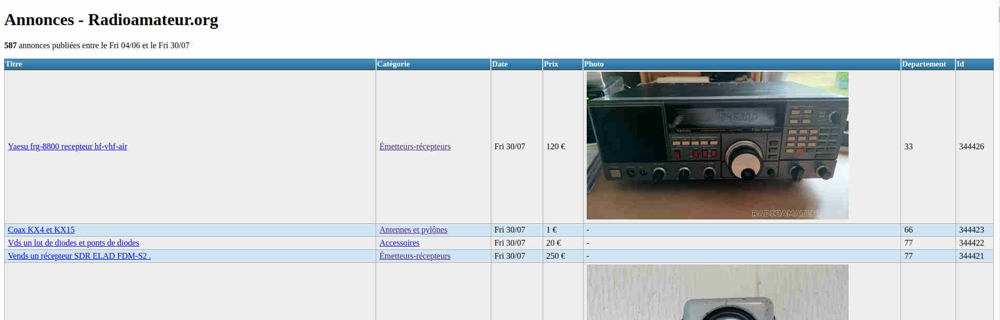

# annonces-radioamateur-org

Petit script pour scrapper la page de petites annonces [https://www.radioamateur.org](https://www.radioamateur.org/) et enlever les annonces de la catégorie "Recherche". Le tout va dans un fichier JSON et flux RSS.

## Utilisateur
Lancer `npm install` et `node index.js`. Des fichiers `annonces.json` et `rss.xml` sont créés.
Vous pouvez utilisez la page PHP `index.php` pour explorer les annonces.

## Screenshot


### JSON structure
```json
[
	{
      "id": 0,
      "title": "Yaesu frg-8800 recepteur hf-vhf-air",
      "departement": 33,
      "link": "https://radioamateur.org/annonce/Vente/XXXX",
      "category": "Émetteurs-récepteurs",
      "date": "2021-07-30",
      "content": "Recepteur yaesu frg 8800 hf-vhf-air avec notice pour collectionneurs en etat de marche.ou derriere il manque une trappe derriere ou il devait y avoir des piles peut etre pour des memoires mais je ne confirme pas car je ne connais pas trop en radio. vendu tel quel pour qui connais en l'etat. j'ai connecter un fil est j'ai entendu de radioamateurs sur la lsb. vendu /120 euros",
      "seller": "XXXXX",
      "price": 120,
      "photos": [
        "https://radioamateur.org/photos/XXX.jpg",
        "https://radioamateur.org/photos/XXXX.jpg"
      ]
    }
]
```

